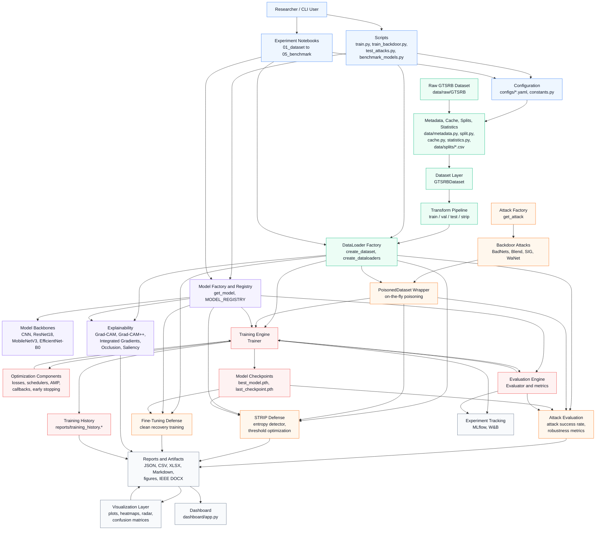
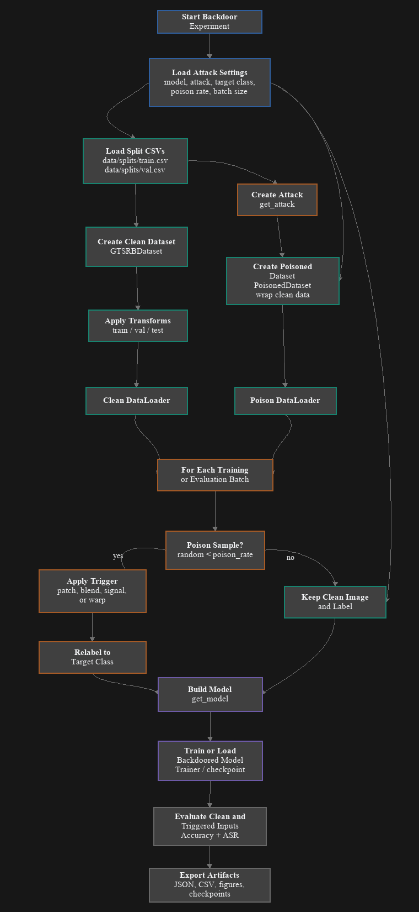
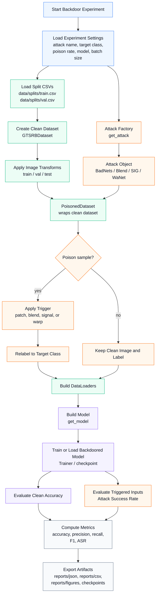
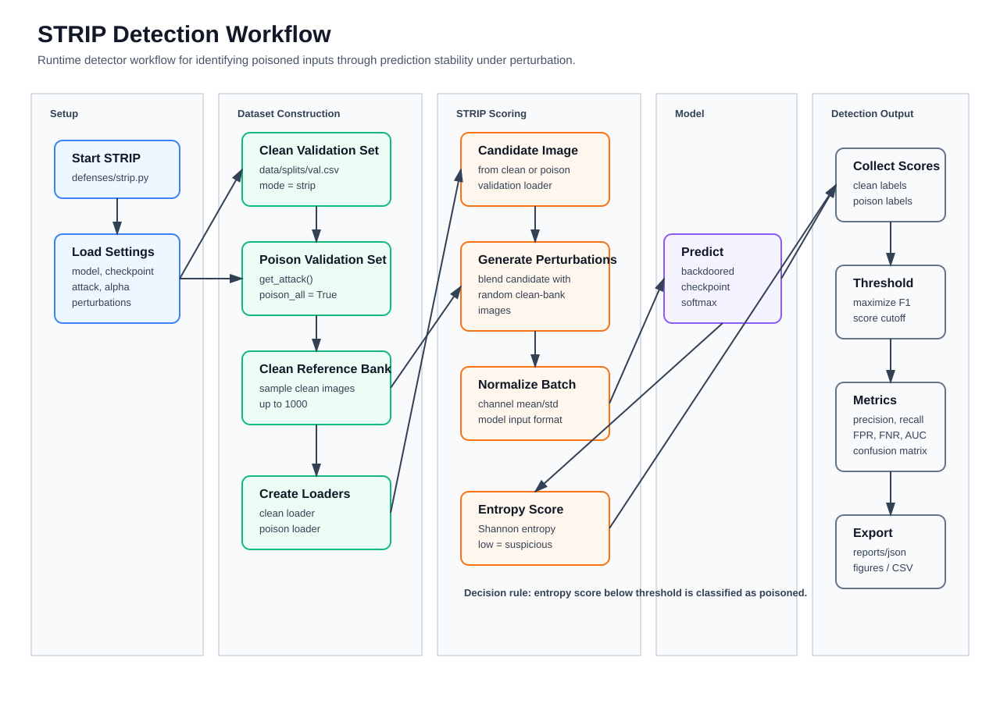
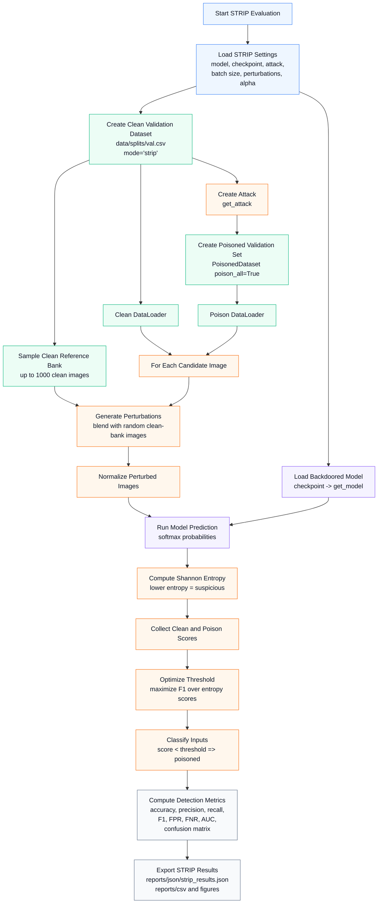
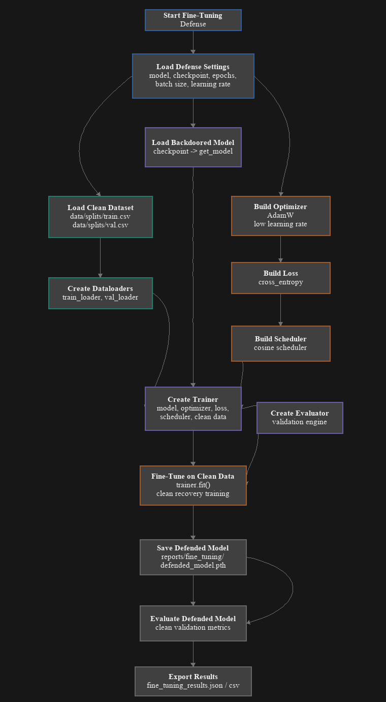
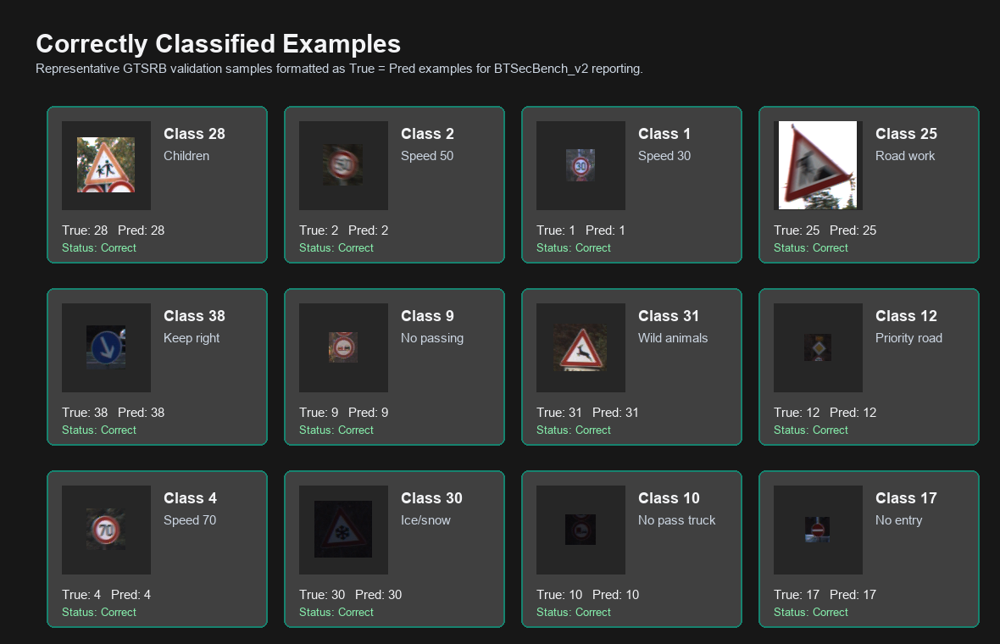
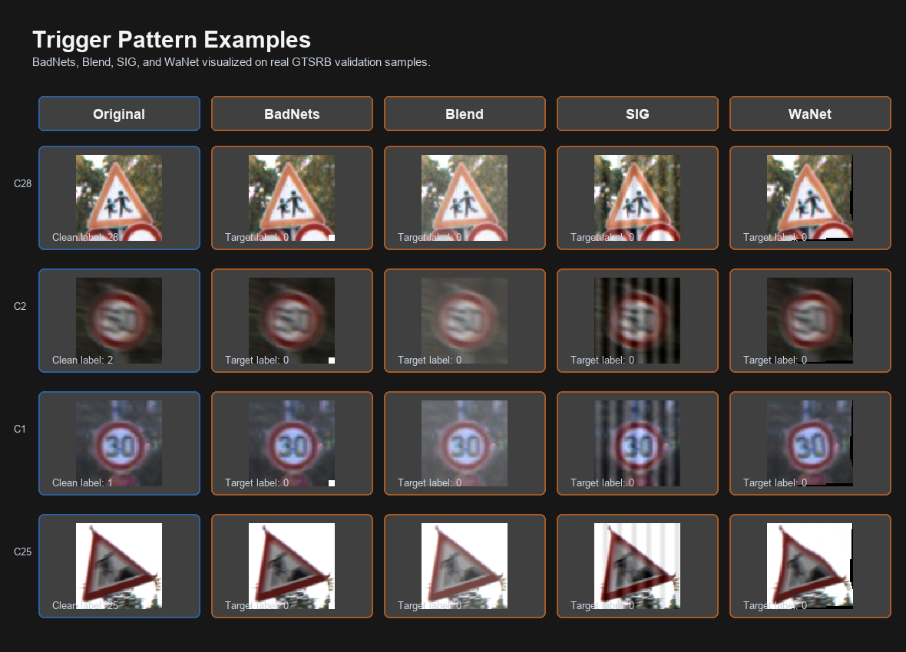

# BTSecBench_v2 System Architecture

## Component Flow

1. Researchers run scripts or notebooks with settings from `configs/`.
2. The data layer prepares GTSRB metadata, split CSVs, transforms, datasets, and dataloaders.
3. The model layer selects a classifier backbone through the registry.
4. Clean or poisoned dataloaders feed the training engine, attack evaluator, defenses, and explainability modules.
5. The training engine coordinates loss, optimizer, scheduler, evaluator, checkpointing, early stopping, and history export.
6. Attack and defense workflows consume trained checkpoints and export benchmark evidence.
7. Reports, figures, tracking logs, and dashboard views present the results.

## Main Runtime Paths

| Path | Purpose |
| --- | --- |
| Clean training | `data/splits/*.csv` -> `GTSRBDataset` -> transforms -> dataloaders -> `get_model` -> `Trainer` -> `Evaluator` -> checkpoints and history |
| Backdoor training/evaluation | clean dataset -> `get_attack` -> `PoisonedDataset` -> model training or attack-success evaluation -> JSON/CSV/figures |
| STRIP detection | checkpoint -> clean validation bank + poisoned validation set -> entropy scores -> threshold optimization -> detection metrics |
| Fine-tuning defense | backdoored checkpoint -> clean dataloaders -> short clean retraining -> defended checkpoint -> validation report |
| Explainability | trained model + sample images -> saliency/Grad-CAM/occlusion/integrated gradients -> visual artifacts |

## Backdoor Attack Pipeline

The backdoor pipeline starts from clean GTSRB split files, wraps the clean dataset with a selected attack, poisons a configurable portion of samples, trains or loads a model, then measures clean accuracy and attack success rate. The main implementation points are `attacks/attack_factory.py`, `attacks/base_attack.py`, `attacks/poisoned_dataset.py`, `data/dataloader.py`, `models/model_factory.py`, and the training/evaluation engine.

## STRIP Detection Workflow

STRIP detects potential backdoor inputs by checking prediction stability under random image blending. Clean samples should usually become less stable under perturbation, while triggered samples may keep a consistent target prediction. In this project, the workflow is implemented mainly in `defenses/strip.py` and exports detection results under `reports/`.

## Fine-Tuning Defense Workflow

The fine-tuning defense loads a backdoored checkpoint, rebuilds the selected model, trains it for a short recovery phase on clean train/validation data, saves a defended checkpoint, evaluates clean validation performance, and exports JSON/CSV evidence under `reports/fine_tuning/`. The main implementation is `defenses/fine_tuning.py`.

## Correctly Classified Examples

This figure shows representative GTSRB validation samples formatted as clean examples with matching true/predicted labels for report presentation.

## Trigger Pattern Examples

This figure shows real validation samples after applying the project-style BadNets, Blend, SIG, and WaNet trigger patterns.
